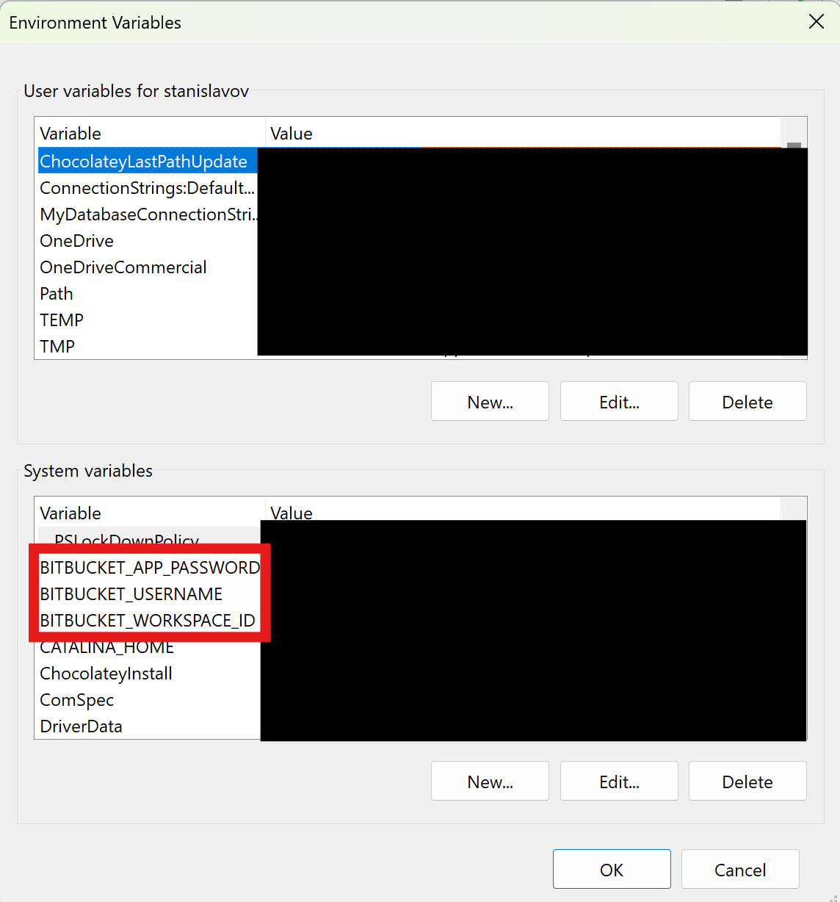

# Bitbucket Scraper

Bitbucket Scraper is a Java application that clones all repositories from a specified Bitbucket workspace into a local directory.
The application uses command-line arguments to specify the workspace, username, password, and directory,
With the option to fall back on environment variables if these arguments are not provided.

## Prerequisites

- Java 21
- Maven 3.9.7 and above

## Setup

1. **Clone the repository**

   ```bash
   git clone https://cpthermes@bitbucket.org/codemasters1/bitbucket-scraper.git
   cd bitbucket-scraper
   ```

2. **Build the application**

    ```bash
    mvn clean install
    ```
   
3. **Running the Application**

   You can run the application with or without command-line arguments. 
   If you don't provide command-line arguments, the application will fall back on environment variables.

    ***Command-Line Arguments***:
      -w or --workspaceId: The Bitbucket workspace ID from which to fetch repositories.
      -u or --username: The Bitbucket username or the app password username.
      -p or --password: The Bitbucket app password for authentication.
      -d or --directory: The directory to clone repositories into.

   Usage Examples

   Using Command-Line Arguments

   ```bash
   java -jar target/repo-scanner-0.0.1-SNAPSHOT.jar -w your_workspace_id -u your_username -p your_password -d /path/to/clone
    ```
   
   ***Using Environment Variables***
   
   Set the environment variables:

   * BITBUCKET_WORKSPACE_ID: The Bitbucket workspace ID.
   * BITBUCKET_USERNAME: The Bitbucket username or the app password username.
   * BITBUCKET_APP_PASSWORD: The Bitbucket app password.
   * CLONE_DIRECTORY: The directory to clone repositories into (optional, defaults to the current directory).
   

   Example on Unix/Linux/Mac:

   ```bash
   export BITBUCKET_WORKSPACE_ID=your_workspace_id
   export BITBUCKET_USERNAME=your_username
   export BITBUCKET_APP_PASSWORD=your_password
   export CLONE_DIRECTORY=/path/to/clone
   ```

   Example on Windows:

   ```bash
   set BITBUCKET_WORKSPACE_ID=your_workspace_id
   set BITBUCKET_USERNAME=your_username
   set BITBUCKET_APP_PASSWORD=your_password
   set CLONE_DIRECTORY=C:\path\to\clone
   ```
   
   Then, run the application

    ```bash
    java -jar target/repo-scanner-0.0.2-SNAPSHOT.jar
    ```
   
   Make sure everything is done within the same cmd session.
   
   However, if you want to have persistent changes, if you are on windows, edit the environment properties from the Control Panel.
   To set up the environment variables, follow these steps:

   

   Make sure to RESTART your IDE before running the application, or the cmd session if you are on Windows.
